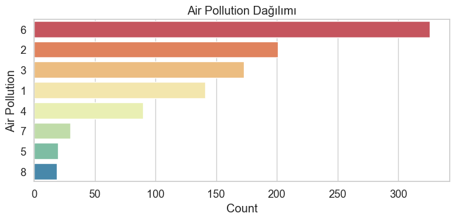
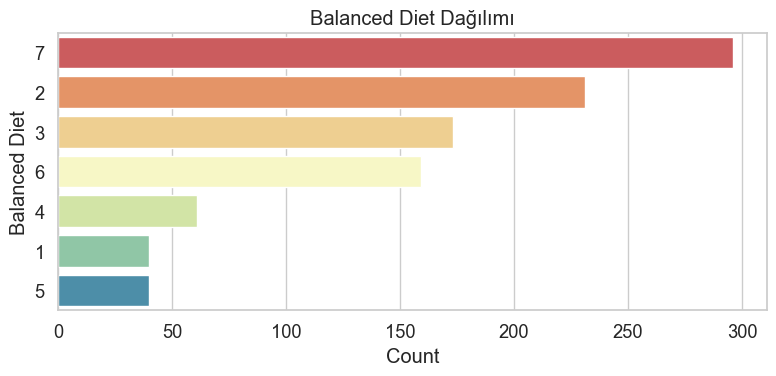
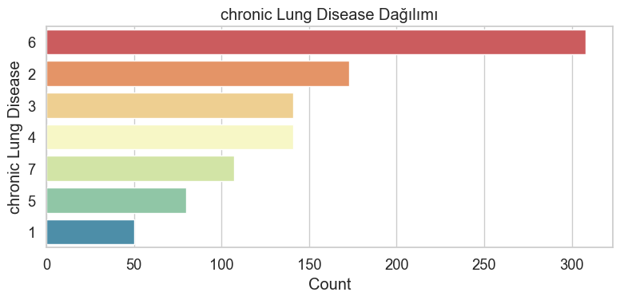
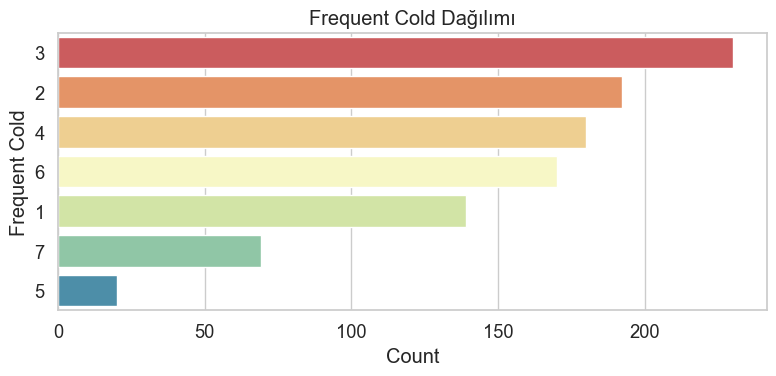
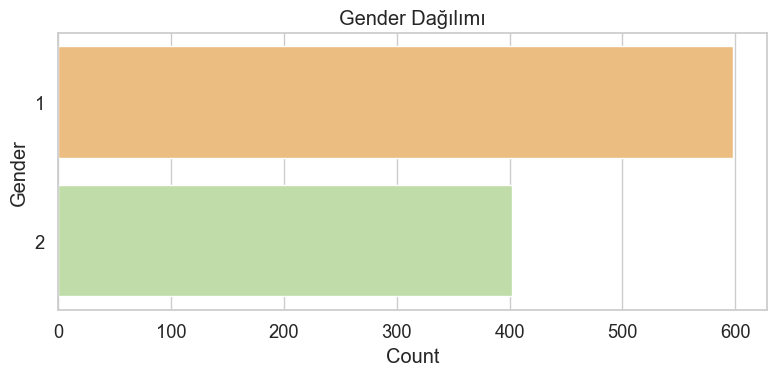
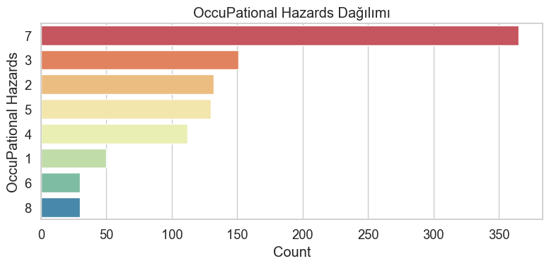
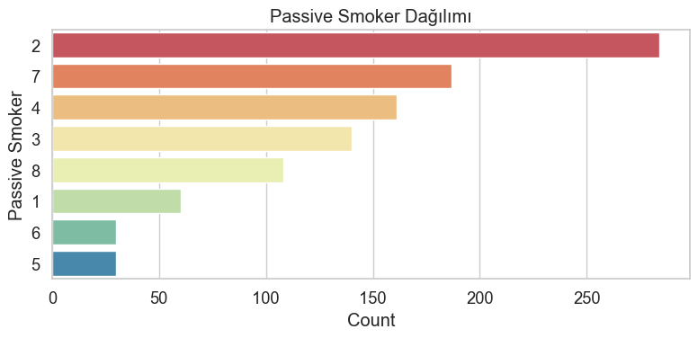
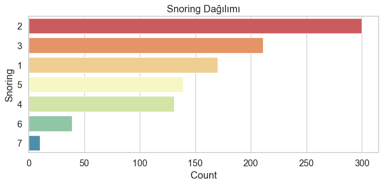
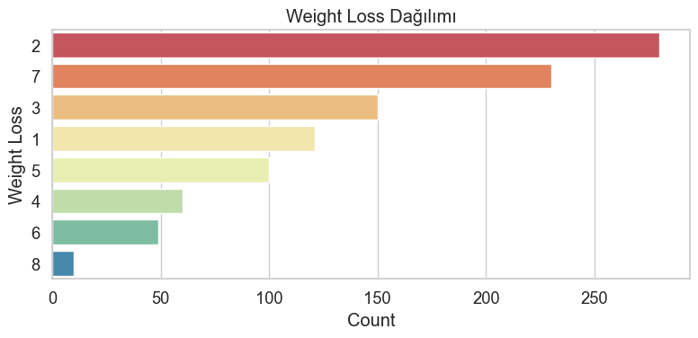

## Exploratory Data Analysis (EDA) Raporu

Proje: CancerAir ML– Akciğer Kanseri Risk Tahmin Sistemi
Hazırlayan: Gizem Can Bayındır (JR AI Developer)
Tarih: 09.12.2025

## 1. Veri Setine Genel Bakış

Toplam satır sayısı: (1000)

Toplam kolon sayısı: (26)

Hedef değişken: Level (Low, Medium, High)

Veri türleri:

Sayısal kolonlar: 'Age'

Kategorik kolonlar: 'Gender', 'Air Pollution', 'Alcohol use',
       'Dust Allergy', 'OccuPational Hazards', 'Genetic Risk',
       'chronic Lung Disease', 'Balanced Diet', 'Obesity', 'Smoking',
       'Passive Smoker', 'Chest Pain', 'Coughing of Blood', 'Fatigue',
       'Weight Loss', 'Shortness of Breath', 'Wheezing',
       'Swallowing Difficulty', 'Clubbing of Finger Nails', 'Frequent Cold',
       'Dry Cough', 'Snoring' , 'Level'

✔ Veri Setinin Yapısı

dtypes: int64(24), object(2)

## 2. Eksik Veri Analizi

index                       0
Patient Id                  0
Age                         0
Gender                      0
Air Pollution               0
Alcohol use                 0
Dust Allergy                0
OccuPational Hazards        0
Genetic Risk                0
chronic Lung Disease        0
Balanced Diet               0
Obesity                     0
Smoking                     0
Passive Smoker              0
Chest Pain                  0
Coughing of Blood           0
Fatigue                     0
Weight Loss                 0
Shortness of Breath         0
Wheezing                    0
Swallowing Difficulty       0
Clubbing of Finger Nails    0
Frequent Cold               0
Dry Cough                   0
Snoring                     0
Level                       0
dtype: int64

Yorum:

Veri setinde eksik veri bulunmamaktadır.

## 3. Kategorik Değişken Analizi

Aşağıdaki kolonlar kategoriktir:

Gender → Kategorik
Air Pollution → Kategorik
Alcohol use → Kategorik
Dust Allergy → Kategorik
OccuPational Hazards → Kategorik
Genetic Risk → Kategorik
chronic Lung Disease → Kategorik
Balanced Diet → Kategorik
Obesity → Kategorik
Smoking → Kategorik
Passive Smoker → Kategorik
Chest Pain → Kategorik
Coughing of Blood → Kategorik
Fatigue → Kategorik
Weight Loss → Kategorik
Shortness of Breath → Kategorik
Wheezing → Kategorik
Swallowing Difficulty → Kategorik
Clubbing of Finger Nails → Kategorik
Frequent Cold → Kategorik
Dry Cough → Kategorik
Snoring → Kategorik
Level → Kategorik
Smoking_Label → Kategorik

### Kategorik Değişken Dağılımları

#### Air Pollution

#### Alcohol use

#### Balanced Diet

#### Chest Pain

#### Chronic Lung Disease

#### Coughing of Blood / Cough

#### Dust Allergy

#### Dry Cough

#### Fatigue

#### Clubbing of Finger Nails

#### Frequent Cold

#### Gender

#### Genetic Risk

#### Level (Target)

#### Obesity

#### Occupational Hazards

#### Passive Smoker

#### Smoking

#### Snoring

#### Swallowing Difficulty

#### Weight Loss

##  4. Sayısal Değişken Analizi (Histogramlar)

## Sayısal Değişken Histogramları

### Age (Yaş) Dağılımı

Kısa Yorum:
Yaş aralığı 30 -40 arasında yoğunlaşmaktadır. Daha geç yaşlar için sayılar düşmüştür.
Özellikle 20–45 yaş arası çok yoğunken 60+ çok daha az sayıda kişi bulunmaktadır.

## 🔥 5. Korelasyon Analizi

### ✔ Sayısal Korelasyon Matrisi

### ✔ Kategorik Korelasyon Matrisi

Yorum:

Tüm kategorik değişkenler LabelEncoder ile sayısallaştırıldıktan sonra elde edilen korelasyon matrisi, veri setindeki risk faktörlerinin ve semptomların belirgin biçimde aynı küme içerisinde toplandığını göstermektedir. Air Pollution, Genetic Risk, Smoking, Passive Smoker, Chronic Lung Disease, Coughing of Blood ve benzeri değişkenler birbirleriyle güçlü pozitif korelasyonlara sahiptir. Bu durum, bu değişkenlerin aynı klinik tabloyu temsil ettiğini ve birlikte ortaya çıktığını ortaya koyar.

Hedef değişken olan **Level**, diğer değişkenlerle düşük seviyede korelasyona sahiptir. Bu beklenen bir sonuçtur; Level değişkeni birçok faktörün birleşimiyle belirlenen bir risk sınıfıdır ve tam anlamıylatek bir değişken ile ifade edilemez. Negatif korelasyonlar LabelEncoder kodlama nedeniyle ortaya çıkar ve anlamsal bir çıkarım içermez.

Aynı bilgiyi taşıyan değişkenler (örneğin Smoking ve Smoking_Label) yüksek korelasyon göstermektedir. Bu durum modelleme aşamasında multicollinearity riskine dikkat edilmesi gerektiğini gösterir.

Genel olarak korelasyon matrisi, risk faktörleri ve semptomların kümelendiğini, Level’ın ise bütün bu faktörlerin birleşik etkisiyle şekillenen bir hedef değişken olduğunu doğrulamaktadır.

## ⭐ 6. Feature Importance (Hızlı Model Sonucu):

Buraya RF importance grafiğini ekle:

docs/plots/feature_importance.png

📝 Kısa Yorum:

Model, en önemli değişkenler olarak:

Smoking

Genetic Risk

Chronic Lung Disease

Air Pollution
gibi özellikleri öne çıkarmıştır.

Balanced Diet – Obesity gibi bazı değişkenlerin önem skoru çok düşüktür.

## 🧠 7. Veri Kalitesi Değerlendirmesi

✔ Güçlü yanlar:

Eksik veri yok

Kolon isimleri anlaşılır

Tüm değişkenler sayısal/ordinal → encode kolay

Hedef değişken belli

❗ Zayıf yanlar:

Değişkenlerin ölçüm yöntemi ve tanımları belirsiz

Birçok kolon ordinal ama “1–8 neyi temsil ediyor?” net değil

Bazı kolonlar birbirine çok benzer (multicollinearity)

## 🧩 8. Modellemeye Alınacak Kolonlar Hakkında Karar

✔ Güçlü etkisi olan kolonlar:

Smoking

Genetic Risk

Chronic Lung Disease

Air Pollution

❗ Zayıf etkisi olan ve çıkarılabilecek kolonlar:

Balanced Diet

Obesity

Fatigue gibi düşük varyanslı kolonlar

🎉 SONUÇ

EDA tamamlanmış, veri yapısı, kalite analizi, hedef dağılımı ve önemli değişkenler belirlenmiştir.
Modelleme aşamasına geçmek için gerekli tüm temel bilgiler hazırdır.